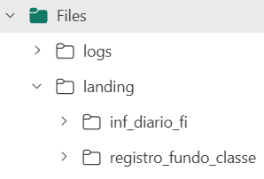
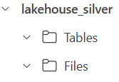
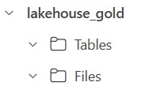

# Projeto Fabric - CVM Fundos de Investimento

Este repositório contém a estrutura completa de um projeto no Microsoft Fabric, implementando a arquitetura medalhão (bronze, silver, gold), com:

- ✅ 3 Lakehouses organizados por workspace
- ✅ Notebooks para ingestão e tranformação
- ✅ Pipelines para orquestração
- ✅ Compatível com reuso em múltiplos workspaces
- [ ] Painel/dashboard informe diário

---

## Como implantar em um novo workspace

`Caso tenha problema na implantação conforme orientações abaixo, favor entrar em contato que providenciremos outra abordagem.`


### 1. Criar novo workspace no Fabric

- Acesse [Microsoft Fabric](https://app.fabric.microsoft.com)
- Vá para **Workspaces** > **+ New workspace**
- Defina o nome do workspace `fundos_investimento-prod`

---

### 2. Criar os 3 Lakehouses

Vá para **Workspaces** > **+ New workspace**
Você deve criar os Lakehouses com os seguintes nomes exatos:

- `lakehouse_bronze`
- `lakehouse_silver`
- `lakehouse_gold`

#### ✅ Como criar:
1. No workspace, clique em **+ Novo item > Lakehouse**
2. Nomeie como: `lakehouse_bronze`, em Files crie as subpastas(`inf_diario_fi` , `registro_fundo_classe` e `logs`) conforme estrutura abaixo:



  e repita para os outros `lakehouse_silver` e `lakehouse_gold`  que deverá ter no final a estrutura abaixo:






---

### 3. Clonar ou fazer fork do repositório

Você pode usar este repositório público via:

#### Opção 1: Fork (mais indicado para customizações)
- Clique em **Fork** aqui no GitHub
- Vá no Fabric configurações workspace> Git > Connect to Git > selecione seu fork

#### Opção 2: Clonar diretamente

```
  ```bash
git clone https://github.com/marques-gen/fundos-investimento-fabric.git
```


- Vá no Fabric > Git > Connect to Git


- Informe a URL do repositório público ou privado
`https://github.com/usuario/repositorio.git`

---

### 4. Integrar Git ao workspace

No Fabric:

1. Acesse o workspace criado
2. Clique em **Git > Connect to a repository**
3. Escolha a branch principal (`main` ou `master`)
4. Aguarde a sincronização


---

### 5. Vincular notebooks aos Lakehouses

> Os notebooks são importados do Git, mas **não ficam automaticamente conectados aos Lakehouses**.

Para cada notebook:

1. Clique no notebook (ex: `inf_diario_ingestao.ipynb`)
2. Vá em **“Lakehouse” (menu superior)** > **“Add Lakehouse”**
3. Selecione o Lakehouse correto (ex: `lakehouse_bronze`)
4. Salve

**Repita para todos os notebooks**, vinculando à camada correta.

---

### 6. Criar atalhos (shortcuts) entre camadas

Para facilitar a leitura entre Lakehouses (ex: a Silver ler da Bronze):

1. Acesse `lakehouse_silver`
2. Clique em **+ Add shortcut > Lakehouse**
3. Selecione `lakehouse_bronze`

Repita para:

- `lakehouse_gold` → adicionar shortcut da `lakehouse_silver`

---

### 7. Rodar o pipeline de teste

Após vincular notebooks e garantir que os Lakehouses estão criados:

1. Vá em **Data Pipelines**
2. Clique no pipeline principal (ex: `pipeline_ingestao`)
3. Clique em **Run pipeline**
4. Monitore o status

---

### 8. Aguardar futuras atualizações incrementais

- O pipeline está preparado para ingestão incremental.
- Novos dados serão integrados automaticamente com base no controle de arquivos e datas.

---
### 9. Próximas entregas(itens que ficaram pendentes)
- `modelagem da camada gold`
- `criação do modelo semântico`
- `Painel/Dashboard`

### 9. Evolução e melhoria contínua
```
coletar requisitos

```